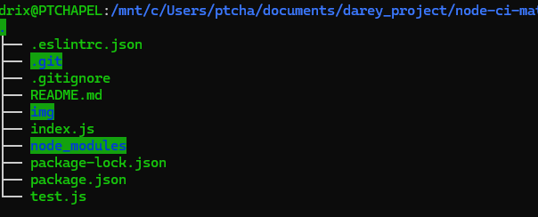
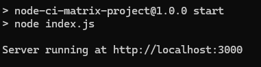
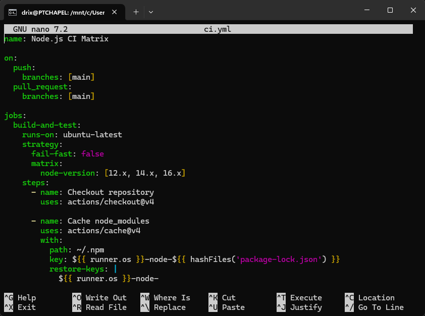

# Node.js CI Matrix Project

This project is part of **Module 3: Implementing Continuous Integration with GitHub Actions**, focusing on automating a Node.js application’s build, test, and linting processes using a build matrix and code quality checks. The project follows **Lesson 2: Configuring Build Matrices** and **Lesson 3: Integrating Code Quality Checks** from the course guide.

## Project Overview

This project demonstrates how to use GitHub Actions to automate testing and linting of a Node.js application across multiple Node.js versions (`12.x`, `14.x`, `16.x`). It includes:

- A simple Express.js server serving a static webpage.
- Unit and integration tests using Mocha, Chai, and Supertest.
- Linting with ESLint to enforce code quality.
- A GitHub Actions workflow with a build matrix and caching for efficient dependency management.

The CI pipeline ensures code is tested and linted across multiple environments, maintaining quality and compatibility.

## Prerequisites

- **GitHub Account**: For creating and managing the repository.
- **Git Installed**: For version control.
- **Node.js and npm Installed**: For running the application and tests.
- **Familiarity with JavaScript**: To understand the code and tests.
- **Text Editor or IDE**: Visual Studio Code used for editing.
- **Command Line Interface (CLI)**: For running commands (e.g., WSL or terminal).
- **Basic Understanding of YAML**: To configure GitHub Actions workflows.
- **Internet Connection**: For GitHub and npm operations.

## Step-by-Step Implementation

### 1. Setting Up the GitHub Repository

1. **Created a GitHub Repository**:
   - Created `node-ci-matrix-project` on GitHub.
   - Initialized with a `README.md` and `.gitignore` (Node.js template).
   - Cloned locally:
     ```bash
     git clone https://github.com/your-username/node-ci-matrix-project.git
     cd node-ci-matrix-project
     ```

### 2. Creating the Node.js Application

1. **Initialized the Node.js Project**:
   - Initialized with:
     ```bash
     npm init -y
     ```
   - Installed Express:
     ```bash
     npm install express
     ```
   - Installed devDependencies:
     ```bash
     npm install mocha chai supertest eslint eslint-config-airbnb-base eslint-plugin-import eslint-plugin-mocha eslint-plugin-chai-expect --save-dev
     ```

   

2. **Created Application Code**:
   - Created `index.js` for the Express server (see `index.js` artifact).
   - Created `test.js` with unit and integration tests (see `test.js` artifact).
   - Configured ESLint with `.eslintrc.json` (see `.eslintrc.json` artifact).
   - Updated `package.json` with scripts (see `package.json` artifact).

    

3. **Tested Locally**:
   - Ran the application:
     ```bash
     npm start
     ```
     - Verified at `http://localhost:3000`.
   - Ran tests:
     ```bash
     npm test
     ```
   - Ran linting:
     ```bash
     npm run lint
     ```

   

   

   

### 3. Setting Up GitHub Actions CI Workflow

1. **Created the CI Workflow File**:
   - Created `.github/workflows/ci.yml` with a build matrix for Node.js `12.x`, `14.x`, `16.x`, caching, and linting (see `ci.yml` artifact).

   

2. **Pushed Changes to GitHub**:
   - Committed and pushed:
     ```bash
     git add .
     git commit -m "Initial setup with Express app, tests, ESLint, and GitHub Actions CI with matrix"
     git push origin main
     ```

   

3. **Verified Workflow Execution**:
   - Checked the GitHub Actions tab for the `Node.js CI Matrix` run.
   - Confirmed all matrix jobs (`12.x`, `14.x`, `16.x`) passed, including `npm ci`, `npm run build`, `npm test`, and `npm run lint`.

   

## Project Structure

```
node-ci-matrix-project/
├── .github/
│   └── workflows/
│       └── ci.yml
├── img/
│   ├── npm-install.png
│   ├── project-files.png
│   ├── local-app-running.png
│   ├── test-results.png
│   ├── lint-results.png
│   ├── ci-yml.png
│   ├── git-push.png
│   ├── ci-workflow.png
├── .eslintrc.json
├── index.js
├── test.js
├── package.json
├── .gitignore
├── node_modules/
└── README.md
```

## Lessons Learned

- **Build Matrix**: Configured a matrix to test across Node.js `12.x`, `14.x`, `16.x` for compatibility.
- **Dependency Management**: Used `actions/cache@v4` to cache `node_modules` based on `package-lock.json`.
- **Code Quality**: Integrated ESLint with `npm run lint` to enforce coding standards.
- **Automation**: Automated build (`npm run build`), test (`npm test`), and linting (`npm run lint`) in the CI pipeline.

## Conclusions

This project provided hands-on experience in setting up a robust Continuous Integration pipeline using GitHub Actions. By implementing a build matrix, I ensured the application’s compatibility across multiple Node.js versions (`12.x`, `14.x`, `16.x`), which is critical for supporting diverse environments. The integration of ESLint enforced consistent code quality, catching potential issues early in the development process. Caching dependencies with `actions/cache@v4` significantly reduced build times, demonstrating the importance of optimizing CI workflows. This project reinforced the value of automating testing and linting, aligning with the puzzle analogy: each code change is a piece that fits seamlessly into the larger software puzzle, verified instantly through CI. The skills learned here—matrix builds, dependency caching, and code quality checks—are foundational for building scalable and reliable software development 